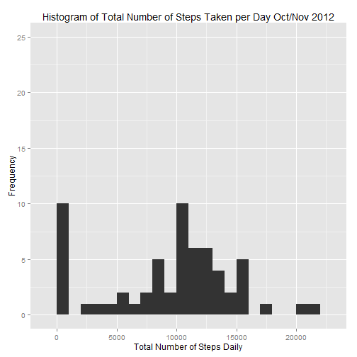
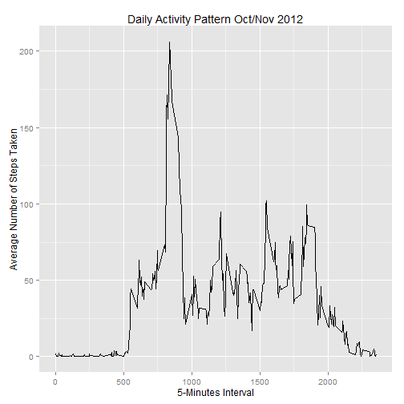
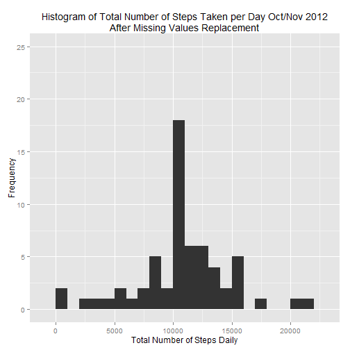
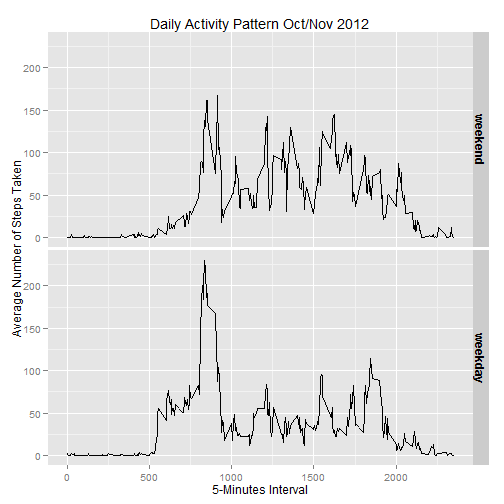

# Reproducible Research: Peer Assessment 1


## Loading and preprocessing the data
Set working directory 

```r
# set working directory
setwd("./courseradatascience/RepData_PeerAssessment1")
```

```
## Error: cannot change working directory
```


### Loading data  

```r
# assign subdirectory where data resides
localZipFile <- "activity.zip"

# assign local zip file
subdir <- "activity"

# if necesary unzip the data file into activity directory
if (!file.exists(subdir)) {
    unzip(localZipFile)
}

# read data
data <- read.csv("./activity/activity.csv", header = TRUE)
```


### Tranforming data to a format suitable for analysis  

```r
# convert date string to Date class
data$date <- as.Date(data$date)
```


## What is mean total number of steps taken per day?

### Histogram of the total number of steps takey each day 

```r
library(plyr)
# aggregate the number of steps taken each day
df0 <- ddply(data, "date", summarise, total = sum(steps, na.rm = TRUE))

# present a summary of total number of steps per day
summary(df0)
```

```
##       date                total      
##  Min.   :2012-10-01   Min.   :    0  
##  1st Qu.:2012-10-16   1st Qu.: 6778  
##  Median :2012-10-31   Median :10395  
##  Mean   :2012-10-31   Mean   : 9354  
##  3rd Qu.:2012-11-15   3rd Qu.:12811  
##  Max.   :2012-11-30   Max.   :21194
```

```r

# draw histogram. assume 1000 steps bin interval from summary above
library(ggplot2)
ggplot(df0, aes(x = total)) + geom_histogram(binwidth = 1000) + scale_y_continuous(limits = c(0, 
    25)) + labs(title = "Histogram of Total Number of Steps Taken per Day Oct/Nov 2012", 
    x = "Total Number of Steps Daily", y = "Frequency")
```

 


### Calculate mean and median of total number of steps per day 

```r
steps.mean <- formatC(round(mean(df0$total, na.rm = TRUE)), format = "d", big.mark = ",")
steps.median <- formatC(round(median(df0$total, na.rm = TRUE)), format = "d", 
    big.mark = ",")
```

The mean of total number of steps taken each day is 9,354    
The median of total number of steps taken each day is 10,395   
   
## What is the average daily activity pattern?
### Time series plot of 5-minute interval(x-axis) over average number of steps taken, averaged across all days (y-axis) 

```r
# average number of steps taken on each 5-min interval across all days
df1 <- ddply(data, "interval", summarise, average = mean(steps, na.rm = TRUE))

# plot 5-min intervals (x-axis) and average number of steps taken across
# all-days (y-axis)
ggplot(df1, aes(x = interval, y = average)) + geom_line() + labs(title = "Daily Activity Pattern Oct/Nov 2012", 
    x = "5-Minutes Interval", y = "Average Number of Steps Taken")
```

 

### 5-minute interval, on average across all days in the dataset, containing the maximum number of steps

```r
z <- round(max(df1$average))
max.interval <- df1[df1$average > z, ][1, 1]
```

The 5-minute interval number (on average across all days) containing the maximum number of steps is 835  

## Inputing missing values
### Calculating and reporting the number of missing values in the dataset

```r
# calculate number of NA values
missing.steps <- formatC(sum(is.na(data$steps) > 0), format = "d", big.mark = ",")
missing.date <- formatC(sum(is.na(data$date) > 0), format = "d", big.mark = ",")
missing.interval <- formatC(sum(is.na(data$interval) > 0), format = "d", big.mark = ",")
```

Number of missing step values is 2,304   
Number of missing date values is 0   
Number of missing interval values is 0    

### Strategy handling replacing missing values: replace missing values with mean for corresponding 5-minute interval

```r
# recalculate means for 5-minute interval (rounded)
df2 <- ddply(data, "interval", summarise, average = round(mean(steps, na.rm = TRUE)))

# identify rows with missing values
data.na <- data[is.na(data$steps) > 0, ]
```


### Creating a new dataset with missing values replaced 

```r
# copy dataset
data.new <- data

# replaced values counter
j <- 0

# loop through new dataset and replace NAs 5-minute interval mean number of
# steps
for (i in seq(1, nrow(data.new))) {
    # check for missing values
    if (complete.cases(data.new[i, ]) == FALSE) {
        # identify interval
        interval <- data.new[i, "interval"]
        # replace missing values with average steps taken on corresponding interval
        data.new[i, "steps"] <- df2[df2$interval == interval, "average"]
        j <- j + 1
    }
}
```

Number of missing values replaced 2304

### Histogram of total number of steps taken each day with new dataset 

```r
library(plyr)
# aggregate the number of steps taken each day
df3 <- ddply(data.new, "date", summarise, total = sum(steps))

# present a summary of total number of steps per day
summary(df3)
```

```
##       date                total      
##  Min.   :2012-10-01   Min.   :   41  
##  1st Qu.:2012-10-16   1st Qu.: 9819  
##  Median :2012-10-31   Median :10762  
##  Mean   :2012-10-31   Mean   :10766  
##  3rd Qu.:2012-11-15   3rd Qu.:12811  
##  Max.   :2012-11-30   Max.   :21194
```

```r

# draw histogram. assume 1000 steps bin interval from summary above
library(ggplot2)
ggplot(df3, aes(x = total)) + geom_histogram(binwidth = 1000) + scale_y_continuous(limits = c(0, 
    25)) + labs(title = "Histogram of Total Number of Steps Taken per Day Oct/Nov 2012\nAfter Missing Values Replacement", 
    x = "Total Number of Steps Daily", y = "Frequency")
```

 


### Calculate mean and median of total number of steps per day for the new dataset with imputted missing data  

```r
steps.mean.new <- formatC(round(mean(df3$total, na.rm = TRUE)), format = "d", 
    big.mark = ",")
steps.median.new <- formatC(round(median(df3$total, na.rm = TRUE)), format = "d", 
    big.mark = ",")
```

For the new dataset (after missing values replacement):   
The mean of total number of steps taken each day for the new dataset is 10,766    
The median of total number of steps taken each day is 10,762 

### Impact of imputting missing data on the estimates of total number of steps  
Original dataset (with missing values removed): Mean = 9,354 - Median = 10,395     
New dataset (after missing values replacement): Mean = 10,766 - Median = 10,762         
The missing data imputting strategy resulted in a shift of mean and median values to the right in the order of 400 more steps    

## Are there differences in activity patterns between weekdays and weekends?

### Creating a variable to differenciate weekdays from weekend days 

```r
# create factor variable day with two values 'weekend' and 'weekday'
data.new$day <- as.factor(ifelse(substr(weekdays(data.new$date), 1, 1) == "S", 
    "weekend", "weekday"))
```


### Making a panel plot of the 5-minute interval (x-axis) and the average number of steps taken, averaged across all weekday days or weekend days (y-axis) 

```r
# calculate means for 5-minute interval (rounded)
df4 <- ddply(data.new, c("day", "interval"), summarise, average = round(mean(steps)))

# panel plot for 5-min intervals (x-axis) and average number of steps taken
# across all-days (y-axis)
ggplot(df4, aes(x = interval, y = average)) + geom_line() + facet_grid(day ~ 
    ., as.table = FALSE) + theme(strip.text.y = element_text(size = 12, face = "bold")) + 
    labs(title = "Daily Activity Pattern Oct/Nov 2012", x = "5-Minutes Interval", 
        y = "Average Number of Steps Taken")
```

 

